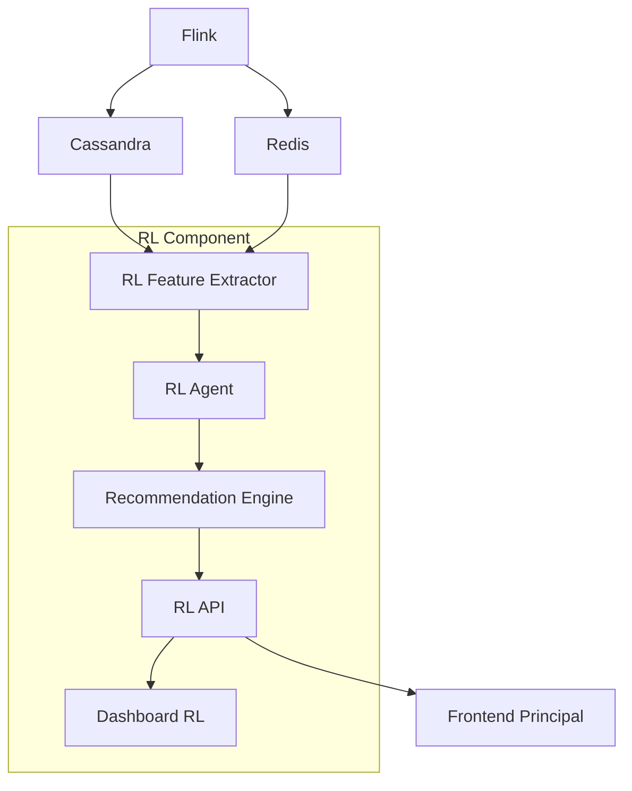

# 🤖 Componente de Reinforcement Learning para E-commerce

Este componente implementa un sistema de recomendación dinámico usando **Reinforcement Learning** para optimizar las recomendaciones de productos en tiempo real, maximizando la conversión y el valor del carrito de compras.

## 🎯 Problema Resuelto

**Optimización de Recomendaciones de Productos:**
- El agente RL aprende qué tipos de recomendaciones funcionan mejor para diferentes perfiles de clientes
- Se adapta dinámicamente al comportamiento del usuario
- Maximiza métricas como conversión, revenue y engagement

## 🏗️ Arquitectura del Componente



## 📊 Tablas de Cassandra para RL

### **rl_agent_state**
Almacena el estado del agente RL en cada paso de decisión.

### **rl_recommendations**
Historial de recomendaciones generadas con métricas de rendimiento.

### **rl_rewards_history**
Registro de recompensas recibidas para entrenamiento del modelo.

### **rl_model_metrics**
Métricas de rendimiento del modelo (conversión, revenue, etc.).

### **shopping_cart_state**
Estado del carrito de compras para análisis contextual.

### **user_interaction_events**
Eventos de interacción del usuario para features.

### **rl_policy_store**
Políticas del agente (epsilon-greedy, softmax, UCB).

## 🧠 Algoritmo de Reinforcement Learning

### **Estado (State)**
- Cart total y número de items
- Tiempo en sesión
- Preferencias de categorías
- Sensibilidad al precio
- Nivel de engagement
- Contexto temporal (hora, día)

### **Acciones (Actions)**
- `low_price`: Recomendar productos de bajo precio
- `medium_price`: Recomendar productos de precio medio
- `high_price`: Recomendar productos de alto precio
- `popular`: Recomendar productos populares
- `personalized`: Recomendación personalizada

### **Recompensas (Rewards)**
- **Conversión**: +1.0 si el usuario compra
- **Revenue**: Proporcional al valor de la compra
- **Engagement**: +0.5 por interacción positiva
- **Retención**: +0.3 si el usuario regresa

### **Política de Exploración**
- **Epsilon-Greedy**: 10% exploración, 90% explotación
- **Learning Rate**: 0.01
- **Discount Factor**: 0.95

## 🚀 Instalación y Configuración

### **1. Dependencias**
```bash
cd 7.0_rl
pip install -r requirements.txt
```

### **2. Variables de Entorno**
```bash
# Cassandra
CASSANDRA_HOST=cassandra
CASSANDRA_PORT=9042

# Redis
REDIS_HOST=redis
REDIS_PORT=6379

# RL API
RL_API_PORT=5000
DASH_PORT=8050
```

### **3. Inicialización de Tablas**
```bash
# Ejecutar script de inicialización
cqlsh -f src/init_rl_tables.cql cassandra 9042
```

## 🌐 API REST

### **Endpoints Principales**

#### **GET /health**
Health check del servicio RL.

#### **POST /api/v1/rl/recommendations**
Generar recomendaciones para un cliente.
```json
{
  "customer_id": "CUST001",
  "session_id": "session_123"
}
```

#### **POST /api/v1/rl/reward**
Enviar recompensa para entrenar el agente.
```json
{
  "customer_id": "CUST001",
  "session_id": "session_123",
  "reward_value": 1.0,
  "action_type": "low_price",
  "recommended_products": ["PROD1", "PROD2"],
  "confidence_score": 0.85
}
```

#### **GET /api/v1/rl/metrics**
Obtener métricas del modelo RL.
```
/api/v1/rl/metrics?model_version=v1.0&days=7
```

#### **GET /api/v1/rl/recommendations/history**
Historial de recomendaciones.
```
/api/v1/rl/recommendations/history?customer_id=CUST001&limit=10
```

#### **GET /api/v1/rl/agent/state**
Estado actual del agente RL.

## 📊 Dashboard de RL

### **Características**
- **Métricas en Tiempo Real**: Q-table size, epsilon, learning rate
- **Gráficos de Recompensas**: Evolución por episodio
- **Distribución de Acciones**: Frecuencia de cada tipo de acción
- **Métricas del Modelo**: Conversión, revenue, confidence
- **Generador de Recomendaciones**: Prueba interactiva
- **Historial de Rendimiento**: Tendencias temporales

### **Acceso**
- **URL**: http://localhost:8050
- **Actualización**: Cada 30 segundos
- **Interactividad**: Generación de recomendaciones en tiempo real

## 🔄 Flujo de Datos

### **1. Ingesta de Datos**
```
Flink → Cassandra (transacciones, métricas)
Flink → Redis (datos en tiempo real)
```

### **2. Extracción de Features**
```
Cassandra → RL Feature Extractor
- Historial de compras
- Preferencias de categorías
- Métricas de engagement
```

### **3. Generación de Recomendaciones**
```
RL Agent → Recommendation Engine
- Análisis del estado actual
- Selección de acción óptima
- Generación de productos recomendados
```

### **4. Feedback y Aprendizaje**
```
User Interaction → Reward Calculation
- Conversión → +1.0
- Revenue → Proporcional
- Engagement → +0.5
```

## 🎯 Casos de Uso

### **1. Recomendación Personalizada**
- Cliente con alto engagement → Acción `personalized`
- Cliente sensible al precio → Acción `low_price`
- Cliente premium → Acción `high_price`

### **2. Optimización de Conversión**
- A/B testing automático de estrategias
- Adaptación a patrones temporales
- Optimización por segmento de cliente

### **3. Maximización de Revenue**
- Balance entre conversión y valor promedio
- Recomendaciones de productos complementarios
- Estrategias de up-selling inteligente

## 📈 Métricas y KPIs

### **Métricas del Agente**
- **Q-Table Size**: Número de estados aprendidos
- **Epsilon**: Tasa de exploración actual
- **Average Reward**: Recompensa promedio por episodio
- **Learning Rate**: Velocidad de aprendizaje

### **Métricas de Negocio**
- **Conversion Rate**: Tasa de conversión de recomendaciones
- **Revenue per Recommendation**: Revenue generado por recomendación
- **Confidence Score**: Confianza del modelo en sus predicciones
- **Engagement Rate**: Tasa de engagement con recomendaciones

## 🔧 Configuración Avanzada

### **Ajuste de Hiperparámetros**
```python
# En rl_agent.py
self.epsilon = 0.1          # Tasa de exploración
self.learning_rate = 0.01   # Velocidad de aprendizaje
self.discount_factor = 0.95 # Factor de descuento
```

### **Personalización de Recompensas**
```python
# Definir función de recompensa personalizada
def calculate_reward(self, action, result):
    base_reward = 0.0
    
    if result['conversion']:
        base_reward += 1.0
        base_reward += result['revenue'] * 0.01
    
    if result['engagement']:
        base_reward += 0.5
    
    return base_reward
```

### **Nuevas Acciones**
```python
# Agregar nuevas acciones al enum
class ActionType(Enum):
    RECOMMEND_LOW_PRICE = "low_price"
    RECOMMEND_MEDIUM_PRICE = "medium_price"
    RECOMMEND_HIGH_PRICE = "high_price"
    RECOMMEND_CATEGORY_MATCH = "category_match"
    RECOMMEND_POPULAR = "popular"
    RECOMMEND_PERSONALIZED = "personalized"
    RECOMMEND_SEASONAL = "seasonal"  # Nueva acción
    RECOMMEND_TRENDING = "trending"  # Nueva acción
```

## 🚀 Despliegue con Docker

### **1. Construir Imagen**
```bash
cd 7.0_rl
docker build -t ecommerce-rl .
```

### **2. Ejecutar Contenedor**
```bash
docker run -d \
  --name ecommerce-rl \
  --network ecommerce-network \
  -p 5000:5000 \
  -p 8050:8050 \
  -e CASSANDRA_HOST=cassandra \
  -e REDIS_HOST=redis \
  ecommerce-rl
```

### **3. Integración con Docker Compose**
```yaml
rl-component:
  build:
    context: ./7.0_rl
    dockerfile: Dockerfile
  ports:
    - "5000:5000"
    - "8050:8050"
  environment:
    - CASSANDRA_HOST=cassandra
    - REDIS_HOST=redis
  depends_on:
    - cassandra
    - redis
```

## 🔍 Monitoreo y Debugging

### **Logs del Agente**
```bash
# Ver logs del contenedor RL
docker logs ecommerce-rl

# Ver logs específicos de la API
docker exec ecommerce-rl tail -f /app/logs/rl_api.log
```

### **Métricas de Cassandra**
```sql
-- Ver estado del agente
SELECT * FROM rl_agent_state 
WHERE agent_id = 'recommendation_agent' 
ORDER BY state_timestamp DESC LIMIT 10;

-- Ver recomendaciones recientes
SELECT * FROM rl_recommendations 
ORDER BY recommendation_timestamp DESC LIMIT 10;

-- Ver métricas del modelo
SELECT * FROM rl_model_metrics 
WHERE model_version = 'v1.0' 
ORDER BY metric_timestamp DESC LIMIT 10;
```

### **Métricas de Redis**
```bash
# Conectar a Redis
docker exec -it ecommerce-redis redis-cli

# Ver keys relacionadas con RL
KEYS *rl*
```

## 🎓 Aplicaciones en E-commerce

### **1. Recomendación de Productos**
- **Contextual**: Basada en carrito actual
- **Personalizada**: Basada en historial del cliente
- **Temporal**: Adaptada a patrones de tiempo

### **2. Optimización de Precios**
- **Dynamic Pricing**: Ajuste de precios en tiempo real
- **Bundle Optimization**: Paquetes de productos optimizados
- **Discount Strategies**: Estrategias de descuento inteligentes

### **3. Gestión de Inventario**
- **Demand Prediction**: Predicción de demanda
- **Stock Optimization**: Optimización de niveles de stock
- **Supply Chain**: Optimización de cadena de suministro

### **4. Marketing Personalizado**
- **Campaign Optimization**: Optimización de campañas
- **Content Recommendation**: Recomendación de contenido
- **Email Marketing**: Marketing por email personalizado

## 🔮 Futuras Mejoras

### **1. Algoritmos Avanzados**
- **Deep Q-Network (DQN)**: Para estados complejos
- **Actor-Critic**: Para políticas continuas
- **Multi-Agent RL**: Múltiples agentes cooperativos

### **2. Features Avanzadas**
- **Sentiment Analysis**: Análisis de sentimientos
- **Image Recognition**: Reconocimiento de imágenes de productos
- **Natural Language Processing**: Procesamiento de descripciones

### **3. Escalabilidad**
- **Distributed Training**: Entrenamiento distribuido
- **Model Serving**: Servicio de modelos optimizado
- **A/B Testing**: Testing automático de modelos

## 📚 Referencias

- [Reinforcement Learning in E-commerce](https://arxiv.org/abs/2003.00123)
- [Multi-Armed Bandits for Recommendations](https://ieeexplore.ieee.org/document/7344818)
- [Deep Reinforcement Learning for E-commerce](https://dl.acm.org/doi/10.1145/3219819.3219820)

---

**Desarrollado para el Trabajo Final de Maestría en Inteligencia Artificial - UNI - Grupo 5** 